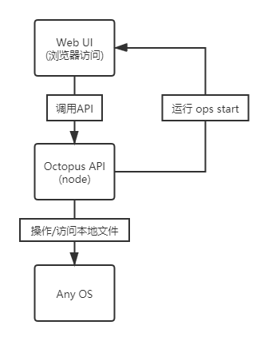

# Octopus 
#### Command Line Interface

### 简介

万能的开发运维工具，提供开箱即用的开发模式、规范、流程，
让不管出于哪一个阶段的你，都可以通过小章鱼做出一个趋近完美的项目，
再也不需要为架构的扩展性、规范性、健壮性而发愁。

### 初衷

经历过太多项目代码烂成一锅粥，造成这个的原因有很多，不过最大的问题还是出在
开发者身上。

因为一个好的项目，前端也好，后端也罢，都离不开一个经验丰富的架构师在前面开荒铺路。
但好的架构师又少的可怜，供需关系就失衡了，失衡的结果就是一大批新手迫于无奈下河摸石，趟出一条个人成长的血泪史，
而项目也无奈被迫跟着这些人，趟过一条蜿蜒崎岖的路来。

所以，制定一套通用且统一的架构体系实在是太重要了。

### 前端理论基础
- [通用单项目结构](./docs/前端理论基础/通用单项目结构.md)
- [通用多项目同构结构](./docs/前端理论基础/通用多项目同构结构.md)
- [模块与业务模型](./docs/前端理论基础/模块与业务模型.md)
- [路由与权限管理](./docs/前端理论基础/路由与权限管理.md)
- [服务与状态管理](./docs/前端理论基础/服务与状态管理.md)
- [API管理](./docs/前端理论基础/API管理.md)
- [组件管理](./docs/前端理论基础/组件管理.md)
- [插件管理](./docs/前端理论基础/插件管理.md)
- [多语言](./docs/前端理论基础/多语言.md)
- [样式管理](./docs/前端理论基础/样式管理.md)
- [资源管理](./docs/前端理论基础/资源管理.md)

### 实现思路
理论存在，实践开始。

#### 基础架构
我将整个工具分为两大部分，一部分负责UI，一部分负责提供API。

负责提供API的部分，就是本仓库开源的内容，是一个 `NPM Global Package`。 
由于 Github 与 NPM 打通，所以大家可以通过以下命令安装：

```shell
npm i -g https://github.com/Eusen/octopus.git
```

负责UI的部分则是基于本仓库提供的API打造的友好访问界面。

这样就形成了下面的组合：



一切都是在你电脑内完成的，不牵扯到访问外部网站。

这样一来，即可以免去我购买服务器的费用，也可以最大限度保护大家隐私，一举两得。

#### 需求分析


